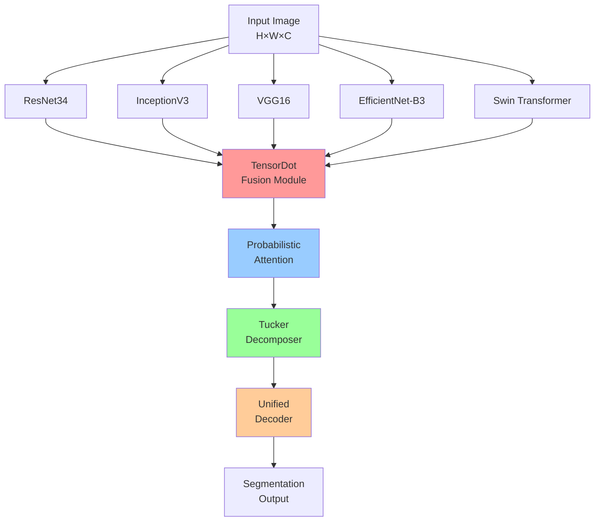

# <h1 align="center">🌍 FWDNNet</h1>


# <h3 align="center">FWDNNet: Cross-Heterogeneous Encoder Fusion via Feature-Level TensorDot Operations for Land-Cover Mapping</h3>

<p align="center">
  
  
  
  
</p>

<p align="center">
  
  
  
  
</p>

<p align="center">
  <strong>✨ Official PyTorch Implementation ✨</strong><br>
  <strong>🎉 Accepted at IEEE Transactions on Geoscience and Remote Sensing (IEEE TGRS) 2025 🎉</strong>
</p>

<p align="center">
  <a href="#-key-features">Key Features</a> •
  <a href="#-getting-started">Getting Started</a> •
  <a href="#-datasets">Datasets</a> •
  <a href="#-results">Results</a> •
  <a href="#-citation">Citation</a> •
  <a href="#-contact">Contact</a>
</p>

---

## 📢 Latest News

```diff
+ 🎊 January 2025: FWDNNet accepted for publication in IEEE TGRS!
+ 📝 November 2024: Manuscript submitted to IEEE TGRS
+ 🚀 October 2024: Code and datasets publicly released
```

---

## 👥 Authors

<table>
<tr>
<td align="center"><strong>Lead Authors</strong></td>
</tr>
<tr>
<td>

**Boaz Mwubahimana**¹ · Graduate Student Member, IEEE  
**Yan Jianguo**¹² · *Corresponding Author*  
**Dingruibo Miao**¹ · *Corresponding Author*

</td>
</tr>
<tr>
<td align="center"><strong>Co-Authors</strong></td>
</tr>
<tr>
<td>

**Swalpa Kumar Roy**³ · Senior Member, IEEE  
**Zhuohong Li**⁴  
**Le Ma**¹  
**Clarisse Kagoyire**⁵  
**Haonan Guo**¹ · Member, IEEE  
**Maurice Mugabowindekwe**⁶  
**Elias Nyandwi**⁵  
**Isaac Nzayisenga**⁷  
**Hafashimana Athanase**⁸  
**Eugene Maridadi**⁹  
**Jean Baptiste Nsengiyumva**¹⁰  
**Elie Byukusenge**¹¹  
**Remy Dukundane**¹²  
**Gaspard Rwanyiziri**⁵  
**Xiao Huang**¹³

</td>
</tr>
</table>

### 🏛️ Affiliations

1. **State Key Laboratory of Information Engineering in Surveying, Mapping and Remote Sensing (LIESMARS)**, Wuhan University, China
2. **Xinjiang Astronomical Observatory**, Chinese Academy of Sciences, China
3. **Department of Computer Science and Engineering**, Tezpur University, India
4. **Nicholas School of the Environment**, Duke University, USA
5. **Center for Geographic Information Systems and Remote Sensing (CGIS)**, University of Rwanda
6. **Department of Geosciences and Natural Resource Management**, University of Copenhagen, Denmark
7. **College of Geography and Remote Sensing**, Hohai University, China
8. **AIMS Research and Innovation Centre & African Centre of Excellence in Data Science**, University of Rwanda
9. **Rwanda Environment Management Authority (REMA)**, Rwanda
10. **WaterAid Rwanda**, Kigali, Rwanda
11. **Water for People Rwanda**, Kigali, Rwanda
12. **College of Engineering**, Carnegie Mellon University, Rwanda
13. **Department of Environmental Sciences**, Emory University, USA

📧 **Corresponding Authors**: 
- Yan Jianguo ([jgyan@whu.edu.cn](mailto:jgyan@whu.edu.cn))
- Dingruibo Miao ([miaodrb@whu.edu.cn](mailto:miaodrb@whu.edu.cn))

---

## 📖 Abstract

<div align="center">


</div>

<br>

We present **FWDNNet**, a novel encoder-decoder architecture that integrates **heterogeneous deep learning backbones** through innovative **TensorDot fusion modules** for high-resolution land cover mapping. Unlike traditional fusion approaches that rely on simple concatenation or averaging, FWDNNet **preserves tensor structures** while enabling **adaptive, probabilistic feature weighting** across five specialized backbone encoders.

### 🔑 Key Innovation

- **TensorDot Fusion**: High-order multilinear transformations that capture complex inter-architectural dependencies
- **Probabilistic Attention**: Variational inference-based adaptive backbone weighting
- **Heterogeneous Integration**: Seamless fusion of CNNs (ResNet34, InceptionV3, VGG16, EfficientNet-B3) and Transformers (Swin-T)

---

## 🎯 Key Features

<table>
<tr>
<td width="25%" align="center">
<br>
<strong>State-of-the-Art Accuracy</strong><br>
<sub>+2.2% over best baseline</sub>
</td>
<td width="25%" align="center">
<br>
<strong>Superior Segmentation</strong><br>
<sub>+1.7% mIoU improvement</sub>
</td>
<td width="25%" align="center">
<br>
<strong>Inference Efficiency</strong><br>
<sub>58.2ms per image</sub>
</td>
<td width="25%" align="center">
<br>
<strong>Resource Efficient</strong><br>
<sub>12.85GB GPU memory</sub>
</td>
</tr>
</table>

### 🏆 Performance Highlights

| Metric | FWDNNet | Best Baseline | Improvement |
|--------|---------|---------------|-------------|
| 🎯 Overall Accuracy | **95.3%** | 93.1% | **+2.2%** ↑ |
| 📊 mean IoU (mIoU) | **91.8%** | 90.1% | **+1.7%** ↑ |
| ⚡ Inference Time | **58.2ms** | 73.8ms | **-21.1%** ↓ |
| 💾 Memory Usage | **12.85GB** | 95.74GB | **-86.6%** ↓ |
| 🔢 Parameters | **35.0M** | 41.0M | **-14.6%** ↓ |
| 🌍 Transfer Score | **97.1%** | 92.3% | **+4.8%** ↑ |

---

## 🏗️ Architecture

<div align="center">
[Uploading main_FWDNNet_frameworkV1.pdf…]()
### Network Overview



</div>

### 🧩 Core Components

<details>
<summary><b>1️⃣ Heterogeneous Encoders</b> (Click to expand)</summary>

Five specialized backbone networks for parallel feature extraction:

| Encoder | Purpose | Key Feature |
|---------|---------|-------------|
| 🔷 **ResNet34** | Residual Learning | Deep feature extraction |
| 🔶 **InceptionV3** | Multi-scale | Multiple receptive fields |
| 🔵 **VGG16** | Hierarchical | Layer-wise features |
| 🟢 **EfficientNet-B3** | Efficiency | Compound scaling |
| 🟣 **Swin Transformer** | Global Context | Shifted window attention |

</details>

<details>
<summary><b>2️⃣ TensorDot Fusion Module</b> (Click to expand)</summary>

**Mathematical Formulation:**

```
𝒯_fused = 𝒢 ×₁ 𝒯₁ ×₂ 𝒯₂ ... ×_M 𝒯_M
```

- Preserves tensor structure
- Captures high-order interactions
- Learnable core tensor 𝒢

</details>

<details>
<summary><b>3️⃣ Probabilistic Attention</b> (Click to expand)</summary>

**Variational Inference Weighting:**

```
𝒲_att = softmax(f_θ(𝒯₁, 𝒯₂, ..., 𝒯_M))
```

- Adaptive backbone selection
- Scene-dependent weighting
- Reduces feature redundancy

</details>

<details>
<summary><b>4️⃣ Multi-Objective Loss</b> (Click to expand)</summary>

**Comprehensive Loss Function:**

```
ℒ_total = ℒ_focal + λ₁ℒ_consist + λ₂ℒ_uncert + λ₃ℒ_div + λ₄ℒ_sparse + λ₅ℒ_bound
```

- Focal loss for class imbalance
- Consistency regularization
- Uncertainty estimation
- Diversity promotion
- Boundary preservation

</details>

---

## 📊 Datasets

### 🌐 Multi-Regional Coverage

<table>
<tr>
<td width="33%" align="center">

#### 🏙️ Dubai Dataset
**Urban Landscapes**

- 📍 Location: UAE
- 🛰️ Sensor: WorldView-3, QuickBird
- 📏 Resolution: 0.31-2.4m
- 🖼️ Images: 1,500
- 📐 Area: 450 km²
- 🏷️ Classes: Built-up, Vegetation, Water, Other

</td>
<td width="33%" align="center">

#### 🌾 Nyagatare Dataset
**Agricultural Lands**

- 📍 Location: Rwanda
- 🛰️ Sensor: Google Earth
- 📏 Resolution: 0.5-1.07m
- 🖼️ Images: 2,200
- 📐 Area: 1,200 km²
- 🏷️ Classes: Crops, Grassland, Forest, Water

</td>
<td width="33%" align="center">

#### 🌾 Oklahoma Dataset
**Great Plains**

- 📍 Location: USA
- 🛰️ Sensor: NAIP
- 📏 Resolution: 0.5-0.60m
- 🖼️ Images: 1,800
- 📐 Area: 2,800 km²
- 🏷️ Classes: 7 land cover types

</td>
</tr>
</table>

### 📥 Download Links

<p align="center">
<a href="https://drive.google.com/file/d/1X_Fz7LQIeix3rV3K29FBfKiU1WMdROe-/view?usp=drive_link">

</a>
<a href="https://drive.google.com/drive/folders/1h9T6w84P8b2xyD81at4JMn30VekAS53E?usp=drive_link">

</a>
</p>

### 📁 Dataset Structure

```
data/
├── Dubai/
│   ├── train/
│   │   ├── images/          # 512×512 RGB patches
│   │   └── labels/          # Ground truth masks
│   ├── val/
│   │   ├── images/
│   │   └── labels/
│   └── test/
│       ├── images/
│       └── labels/
├── Nyagatare/
│   └── [same structure]
└── Oklahoma/
    └── [same structure]
```

---

## 🚀 Getting Started

### 📋 Requirements

<table>
<tr>
<td>

**Core Dependencies**
```
Python >= 3.7
PyTorch >= 1.7.1
torchvision >= 0.8.2
CUDA >= 10.1
```

</td>
<td>

**Additional Packages**
```
opencv-python >= 4.5.5
numpy >= 1.19.5
matplotlib >= 3.3.4
scikit-learn >= 0.24.2
wandb >= 0.13.10
```

</td>
</tr>
</table>

### ⚙️ Installation

```bash
# 1️⃣ Clone the repository
git clone https://github.com/YourUsername/FWDNNet.git
cd FWDNNet

# 2️⃣ Create conda environment
conda create -n fwdnnet python=3.7 -y
conda activate fwdnnet

# 3️⃣ Install PyTorch (CUDA 10.1)
conda install pytorch==1.7.1 torchvision==0.8.2 cudatoolkit=10.1 -c pytorch

# 4️⃣ Install other dependencies
pip install -r requirements.txt

# 5️⃣ Verify installation
python -c "import torch; print(f'PyTorch: {torch.__version__}, CUDA: {torch.cuda.is_available()}')"
```

### 📦 Quick Setup

```bash
# Download datasets and models
bash scripts/download_data.sh

# Prepare dataset
python utils/prepare_dataset.py --dataset all

# Run quick test
python test_installation.py
```

---

## 🎓 Training

### 🏃 Quick Start Training

```bash
# Train on Dubai dataset (default config)
python train.py --dataset Dubai

# Train with custom config
python train.py --config configs/fwdnnet_dubai.yaml

# Multi-GPU training
python -m torch.distributed.launch --nproc_per_node=4 train.py --dataset Dubai
```

### ⚙️ Training Configuration

<details>
<summary><b>📝 Configuration File Example</b> (Click to expand)</summary>

```yaml
# configs/fwdnnet_dubai.yaml
model:
  name: FWDNNet
  encoders:
    - resnet34
    - inception_v3
    - vgg16
    - efficientnet_b3
    - swin_t
  fusion:
    type: tensordot
    tucker_rank: [64, 64, 64]
  attention:
    type: probabilistic
    temperature: 0.1

training:
  batch_size: 16
  epochs: 200
  learning_rate: 1e-3
  optimizer:
    name: AdamW
    betas: [0.9, 0.999]
    weight_decay: 0.01
  scheduler:
    name: ExponentialLR
    gamma: 0.95
    step: 10
  early_stopping:
    patience: 20
    monitor: val_miou

loss:
  focal_weight: 1.0
  consistency_weight: 0.5
  uncertainty_weight: 0.3
  diversity_weight: 0.2
  boundary_weight: 0.4

data:
  input_size: [512, 512]
  num_classes: 4
  augmentation:
    flip: 0.5
    rotate: 45
    elastic: true
    gaussian_noise: 0.02
```

</details>

### 📊 Monitor Training

```bash
# With Weights & Biases
python train.py --dataset Dubai --use_wandb

# With TensorBoard
python train.py --dataset Dubai --use_tensorboard
tensorboard --logdir=runs/
```

### 🔄 Resume Training

```bash
# Resume from checkpoint
python train.py --dataset Dubai --resume checkpoints/fwdnnet_epoch_50.pth

# Resume with different learning rate
python train.py --resume checkpoints/fwdnnet_epoch_50.pth --lr 1e-4
```

---

## 🧪 Evaluation & Inference

### 📈 Evaluation

```bash
# Evaluate on test set
python test.py --dataset Dubai --checkpoint checkpoints/fwdnnet_best.pth

# Evaluate with visualization
python test.py --dataset Dubai --checkpoint checkpoints/fwdnnet_best.pth --visualize

# Cross-domain evaluation
python test.py \
  --source_dataset Dubai \
  --target_dataset Nyagatare \
  --checkpoint checkpoints/fwdnnet_dubai.pth
```

### 🖼️ Inference

```bash
# Single image inference
python inference.py \
  --input path/to/image.tif \
  --checkpoint checkpoints/fwdnnet_best.pth \
  --output results/prediction.png

# Batch inference
python inference.py \
  --input_dir path/to/images/ \
  --checkpoint checkpoints/fwdnnet_best.pth \
  --output_dir results/

# Large-scale inference (tiled processing)
python inference_large.py \
  --input large_image.tif \
  --checkpoint checkpoints/fwdnnet_best.pth \
  --tile_size 512 \
  --overlap 50 \
  --output result_mosaic.tif
```

---

## 📊 Results

### 🏆 Quantitative Performance

<div align="center">

#### Overall Performance Comparison

| Model | Accuracy (%) | mIoU (%) | F1-Score | Inference (ms) | Params (M) | Memory (GB) |
|-------|-------------|----------|----------|----------------|-----------|-------------|
| ResNet-34 | 93.5 | 89.0 | 0.800 | 45.2 | 24.0 | 93.30 |
| InceptionV3 | 80.1 | 84.0 | 0.832 | 52.7 | 30.0 | 114.19 |
| VGG-16 | 82.0 | 88.0 | 0.729 | 38.4 | 24.0 | 90.61 |
| EfficientNet-B3 | 91.8 | 87.3 | 0.825 | 28.6 | 12.0 | 45.67 |
| Swin-T | 89.2 | 86.1 | 0.847 | 67.3 | 28.0 | 78.32 |
| SegFormer-B2 | 92.4 | 88.7 | 0.859 | 41.2 | 25.0 | 62.48 |
| HRNet-W32 | 94.1 | 90.1 | 0.862 | 73.8 | 41.0 | 95.74 |
| **FWDNNet** | **95.3** | **91.8** | **0.876** | **58.2** | **35.0** | **12.85** |

</div>

### 🌍 Dataset-Specific Results

<table>
<tr>
<td align="center"><b>Dubai</b></td>
<td align="center"><b>Nyagatare</b></td>
<td align="center"><b>Oklahoma</b></td>
</tr>
<tr>
<td>

```
OA:    96.1%
mIoU:  92.4%
Built: 95.8%
Water: 96.7%
```

</td>
<td>

```
OA:    94.7%
mIoU:  91.1%
Crops: 94.3%
Forest: 93.2%
```

</td>
<td>

```
OA:    95.0%
mIoU:  91.6%
Veg:   92.7%
Water: 95.1%
```

</td>
</tr>
</table>

### 🔄 Cross-Domain Transfer

| Source → Target | Source mIoU | Target mIoU | Transfer Score |
|----------------|-------------|-------------|----------------|
| Dubai → Nyagatare | 92.4% | 90.1% | **97.5%** |
| Dubai → Oklahoma | 92.4% | 89.3% | **96.6%** |
| Nyagatare → Oklahoma | 91.1% | 89.8% | **98.6%** |

### 💡 Ablation Study

| Configuration | mIoU (%) | Δ mIoU |
|--------------|----------|--------|
| Single Encoder (ResNet34) | 89.0 | - |
| Multi-Encoder (Avg) | 90.1 | +1.1% |
| + TensorDot Fusion | 91.3 | +2.3% |
| + Probabilistic Attention | 91.8 | +2.8% |
| **Full FWDNNet** | **91.8** | **+2.8%** |

### ⚡ Computational Efficiency

<div align="center">

| Metric | FWDNNet | HRNet-W32 | Improvement |
|--------|---------|-----------|-------------|
| 🕐 Training Time | 6.2h | 13.4h | **-53.7%** ⬇️ |
| 💾 Memory Usage | 12.85GB | 95.74GB | **-86.6%** ⬇️ |
| 🔢 Parameters | 35.0M | 41.0M | **-14.6%** ⬇️ |
| 🔄 FLOPs | 45.2G | 52.1G | **-13.2%** ⬇️ |
| 📈 Throughput | 17.2 img/s | 13.5 img/s | **+27.4%** ⬆️ |

</div>

---

## 🖼️ Visualizations

### 🎨 Qualitative Results

*(Space reserved for qualitative comparison figures)*


### 📉 Training Curves 


### 🔍 Feature Maps: *(attention weight visualizations)*


### 🗺️ Large-Scale Mapping

*(regional-scale inference results)*


## 🙏 Acknowledgments

This work was supported by:

- **National Natural Science Foundation of China** (Grant Nos. 42241116 and 42071332)
- **National Key R&D Program of China** (Grant Nos. 2022YFF0503202 and 2022YFB3903605)
- **Macau Science and Technology Development Fund** (SKL-LPS(MUST)-2021-2023)
- **Xinjiang Heaven Lake Talent Program** (2022)

We acknowledge support from:
- **State Key Laboratory of Information Engineering in Surveying, Mapping and Remote Sensing (LIESMARS)**, Wuhan University
- **National Land Authority of Rwanda**
- **Mohammed Bin Rashid Space Centre (MBRSC)** for satellite imagery
- **U.S. Department of Agriculture's National Agriculture Imagery Program (NAIP)** for aerial imagery

---

## 📝 Citation

If you find this work useful in your research, please consider citing:

```bibtex
@article{mwubahimana2025fwdnnet,
  title={FWDNNet: Cross-Heterogeneous Encoder Fusion via Feature-Level TensorDot Operations for Land-Cover Mapping},
  author={Mwubahimana, Boaz and Yan, Jianguo and Miao, Dingruibo and Roy, Swalpa Kumar and Li, Zhuohong and Ma, Le and Kagoyire, Clarisse and Guo, Haonan and Mugabowindekwe, Maurice and Nyandwi, Elias and Nzayisenga, Isaac and Athanase, Hafashimana and Maridadi, Eugene and Nsengiyumva, Jean Baptiste and Byukusenge, Elie and Dukundane, Remy and Rwanyiziri, Gaspard and Huang, Xiao},
  journal={IEEE Transactions on Geoscience and Remote Sensing},
  year={2025},
  publisher={IEEE},
  note={Accepted for publication}
}
```

### 📚 Related Publications

Our previous works on land cover mapping:

```bibtex
@article{mwubahimana2024vhfparanet,
  title={Vision Transformers Feature Harmonization Network for High-Resolution Land Cover Mapping},
  author={Mwubahimana, Boaz and Yan, Jianguo and Roy, Swalpa Kumar and others},
  journal={International Journal of Applied Earth Observation and Geoinformation},
  year={2024}
}
```

---

## 🔗 Related Resources

- 🔬 **VHF-ParaNet**: Vision Transformers Feature Harmonization [[Code](https://github.com/BoazGithub/VHF_ParaNet)] [[Paper](#)]
- 📊 **GLC10 Dataset**: Global Land Cover at 10m resolution [[Link](#)]
- 🛰️ **Google Earth Engine**: Satellite imagery access [[Link](https://earthengine.google.com/)]
- 🗺️ **ESRI Land Cover**: Global land cover products [[Link](https://www.esri.com/)]

---

## 📞 Contact

<div align="center">

### 💬 Get in Touch

For questions, collaborations, or issues:

**📧 Corresponding Authors:**
- **Yan Jianguo**: [jgyan@whu.edu.cn](mailto:jgyan@whu.edu.cn)
- **Dingruibo Miao**: [miaodrb@whu.edu.cn](mailto:miaodrb@whu.edu.cn)

**📧 Lead Author:**
- **Boaz Mwubahimana**: [aiboaz1896@gmail.com](mailto:aiboaz1896@gmail.com) | [m.boaz@whu.edu.cn](mailto:m.boaz@whu.edu.cn)

**🐛 Issues & Contributions:**
- Open an [Issue](https://github.com/YourUsername/FWDNNet/issues)
- Submit a [Pull Request](https://github.com/YourUsername/FWDNNet/pulls)

</div>

---

## 📄 License

```
Copyright (c) 2025 Wuhan University, State Key Laboratory of LIESMARS

This code and datasets are released for NON-COMMERCIAL and RESEARCH purposes only.

For commercial applications, please contact the corresponding authors:
- Yan Jianguo (jgyan@whu.edu.cn)
- Dingruibo Miao (miaodrb@whu.edu.cn)

Licensed under the MIT License for research purposes.
```

---

## ⭐ Star History

<div align="center">

[](https://star-history.com/#YourUsername/FWDNNet&Date)

**If you find this work helpful, please consider giving us a ⭐!**

</div>

---

## 🎓 Recommended Citation Format

**IEEE Style:**
> B. Mwubahimana et al., "FWDNNet: Cross-Heterogeneous Encoder Fusion via Feature-Level TensorDot Operations for Land-Cover Mapping," *IEEE Trans. Geosci. Remote Sens.*, 2025. [Accepted for publication]

**APA Style:**
> Mwubahimana, B., Yan, J., Miao, D., Roy, S. K., Li, Z., Ma, L., ... & Huang, X. (2025). FWDNNet: Cross-Heterogeneous Encoder Fusion via Feature-Level TensorDot Operations for Land-Cover Mapping. *IEEE Transactions on Geoscience and Remote Sensing*. [Accepted for publication]

---

<div align="center">
